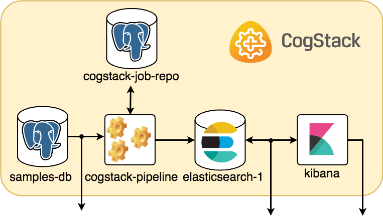

# Archived

This project is archived and no longer maintained. [CogStack-Nifi](https://github.com/CogStack/CogStack-NiFi/tree/master/deploy) is the successor to this project and continues to be actively maintained.

# Introduction

CogStack is a lightweight distributed, fault tolerant database processing architecture and ecosystem, intended to make NLP processing and preprocessing easier in resource constrained environments. It comprises of multiple components, where **CogStack Pipeline**, the one covered in this documentation, has been designed to provide a configurable data processing pipelines for working with EHR data. For the moment it mainly uses databases and files as the primary source of EHR data with the possibility of adding custom data connectors soon. It makes use of the [Java Spring Batch](https://spring.io/projects/spring-batch) framework in order to provide a fully configurable data processing pipeline with the goal of generating an annotated JSON files that can be readily indexed into [ElasticSearch](https://www.elastic.co/), stored as files or pushed back to a database.


# Documentation

For the most up-to-date documentation about usage of CogStack, building, running with example deployments please refer to the official [CogStack Confluence page](https://cogstack.atlassian.net/wiki/spaces/COGDOC/).

# Discussion

If you have any questions why not reach out to the community [discourse forum](https://discourse.cogstack.org/).

# Quick Start Guide

## <a name="intro"></a> Introduction
[//]: # "-------------------------------------------------------------------------------------"
[//]: # "Tutorial introduction"

This simple tutorial demonstrates how to get *CogStack Pipeline* running on a sample electronic health record (EHR) dataset stored initially in an external database. CogStack ecosystem has been designed with handling efficiently both structured and unstructured EHR data in mind. It shows its strength while working with the unstructured type of data, especially as some input data can be provided as documents in PDF or image formats. For the moment, however, we only show how to run CogStack on a set of structured and free-text EHRs that have been already digitalized. The part covering unstructured type of data in form of PDF documents, images and other clinical notes which needs to processed prior to analysis is covered in the official [CogStack Confluence page](https://cogstack.atlassian.net/wiki/spaces/COGDOC/).

This tutorial is divided into 3 parts:
1. Getting CogStack ([link](#getting-cogstack)),
2. A brief description of how does CogStack pipeline work and its ecosystem ([link](#how-does-it-work)),
3. Running CogStack pipeline 'out-of-the-box' using the dataset already preloaded into a sample database ([link](#running-cogstack)).

To skip the brief description and to get hands on running CogStack pipeline please head directly to [Running CogStack](#running-cogstack) part.

The main directory with resources used in this tutorial is available in the CogStack bundle under `examples/`. This tutorial is based on the **Example 2**, however, there are more examples available to play with.


## <a name="getting-cogstack"></a> Getting CogStack

The most convenient way to get CogStack bundle is to download it directly from the [official github repository](https://github.com/CogStack/CogStack-Pipeline) either by cloning the source by using git:
```bash
git clone https://github.com/CogStack/CogStack-Pipeline.git
```
or by downloading the bundle from the repository's [Releases page](https://github.com/CogStack/CogStack-Pipeline/releases) and decompressing it.


## <a name="how-does-it-work"></a> How does CogStack work
[//]: # "-------------------------------------------------------------------------------------"

### Data processing workflow

The data processing workflow of CogStack pipeline is based on [Java Spring Batch](https://spring.io/) framework. Not to dwell too much into technical details and just to give a general idea -- the data is being read from a predefined *data source*, later it follows a number of *processing operations* with the final result stored in a predefined *data sink*. CogStack pipeline implements variety of data processors, data readers and writers with scalability mechanisms that can be selected in CogStack job configuration. Although the data can be possibly read from different sources, the most frequently used data sink is [ElasicSearch](https://www.elastic.co/). For more details about the CogStack functionality, please refer to the [CogStack Documentation](https://cogstack.atlassian.net/wiki/spaces/COGDOC/overview).


[//]: # "Content description"
In this tutorial we only focus on a simple and very common use-case, where CogStack pipeline reads and process structured and free-text EHRs data from a single PostgreSQL database. The result is then stored in ElasticSearch where the data can be easily queried in [Kibana](https://www.elastic.co/products/kibana) dashboard. However, CogStack pipeline data processing engine also supports multiple data sources -- please see [**Example 3**](https://cogstack.atlassian.net/wiki/spaces/COGDOC/) which covers such case.


### A sample CogStack ecosystem

CogStack ecosystem consists of multiple inter-connected microservices running together. For the ease of use and deployment we use [Docker](https://www.docker.com/) (more specifically, [Docker Compose](https://docs.docker.com/compose/)), and provide Compose files for configuring and running the microservices. The selection of running microservices depends mostly on the specification of EHR data source(s), data extraction and processing requirements.

In this tutorial the CogStack ecosystem is composed of the following microservices:
* `samples-db` -- PostgreSQL database loaded with a sample dataset under `db_samples` name,
* `cogstack-pipeline` -- CogStack data processing pipeline with worker(s),
* `cogstack-job-repo` -- PostgreSQL database for storing information about CogStack jobs,
* `elasticsearch-1` -- ElasticSearch search engine (single node) for storing and querying the processed EHR data,
* `kibana` -- Kibana data visualization tool for querying the data from ElasticSearch.

Since all the examples share the common configuration for the microservices used, the base Docker Compose file is provided in `examples/docker-common/docker-compose.yml`. The Docker Compose file with configuration of microservices being overriden for this example can be found in `examples/example2/docker/docker-compose.override.yml`. Both configuration files are automatically used by Docker Compose when deploying CogStack, as will be shown later.


## <a name="datasets"></a> Sample datasets
[//]: # "-------------------------------------------------------------------------------------"

The sample dataset used in this tutorial consists of two types of EHR data:
* Synthetic - structured, synthetic EHRs, generated using [synthea](https://synthetichealth.github.io/synthea/) application,
* Medial reports - unstructured, medical health report documents obtained from [MTsamples](https://www.mtsamples.com).

These datasets, although unrelated, are used together to compose a combined dataset.

Full description of these datasets can be found in the official [CogStack Confluence page](https://cogstack.atlassian.net/wiki/spaces/COGDOC/).


## <a name="running-cogstack"></a> Running CogStack platform
[//]: # "-------------------------------------------------------------------------------------"

### Running CogStack pipeline for the first time

For the ease of use CogStack is being deployed and run using Docker. However, before starting the CogStack ecosystem for the first time, one needs to have the database dump files for sample data either by creating them locally or downloading from Amazon S3.
To download the database dumps, just type in the main `examples/` directory:
```bash
bash download_db_dumps.sh
```

Next, a setup scripts needs to be run locally to prepare the Docker images and configuration files for CogStack data processing pipeline. The script is available in `examples/example2/` path and can be run as:

```bash
bash setup.sh
```

As a result, a temporary directory `__deploy/` will be created containing all the necessary artifacts to deploy CogStack.


### Docker-based deployment

Next, we can proceed to deploy CogStack ecosystem using Docker Compose. It will configure and start microservices based on the provided Compose files:
- common base configuration, copied from `examples/docker-common/docker-compose.yml` ,
- example-specific configuration copied from `examples/example2/docker/docker-compose.override.yml`.
Moreover, the PostgreSQL database container comes with pre-initialized database dump ready to be loaded directly into. 

In order to run CogStack, type in the `examples/example2/__deploy/` directory:
```bash
docker-compose up
```
In the console there will be printed status logs of the currently running microservices. For the moment, however, they may be not very informative (sorry, we're working on that!).


### Connecting to the microservices

#### CogStack ecosystem

The picture below sketches a general idea on how the microservices are running and communicating within a sample CogStack ecosystem used in this tutorial.



[//]: # "Connecting to ES, Kibana and PostgreSQL"
Assuming that everything is working fine, we should be able to connect to the running microservices. Selected running services (`elasticsearch-1` and `kibana`) have their port connections forwarded to host `localhost`.

#### Kibana and ElasticSearch

Kibana dashboard used to query the EHRs can be accessed directly in browser via URL: `http://localhost:5601/`. The data can be queried using a number of ElasticSearch indices, e.g. `sample_observations_view`. Usually, each index will correspond to the database view in `db_samples` (`samples-db` PostgreSQL database) from which the data was ingested. However, when entering Kibana dashboard for the first time, an index pattern needs to be configured in the Kibana management panel -- for more information about its creation, please refer to the official [Kibana documentation](https://www.elastic.co/guide/en/kibana/current/tutorial-define-index.html).

In addition, ElasticSearch REST end-point can be accessed via URL `http://localhost:9200/`. It can be used to perform manual queries or to be used by other external services -- for example, one can list the available indices:
```bash
curl 'http://localhost:9200/_cat/indices'
```
or query one of the available indices -- `sample_observations_view`:
```bash
curl 'http://localhost:9200/sample_observations_view'
```

For more information about possible documents querying or modification operations, please refer to the official [ElasticSearch documentation](https://www.elastic.co/guide/en/elasticsearch/reference/current/getting-started.html).

As a side note, the name for ElasticSearch node in the Docker Compose has been set as `elasticsearch-1`. The `-1` ending emphasizes that for larger-scale deployments, multiple ElasticSearch nodes can be used -- typically, a minimum of 3.


#### PostgreSQL sample database

Moreover, the access PostgreSQL database with the input sample data is exposed directly at `localhost:5555`. The database name is `db_sample` with user *test* and password *test*. To connect, one can run:
```bash
psql -U 'test' -W -d 'db_samples' -h localhost -p 5555
```


## Publications
[CogStack - Experiences Of Deploying Integrated Information Retrieval And Extraction Services In A Large National Health Service Foundation Trust Hospital, *Richard Jackson, Asha Agrawal, Kenneth Lui, Amos Folarin, Honghan Wu, Tudor Groza, Angus Roberts, Genevieve Gorrell, Xingyi Song, Damian Lewsley, Doug Northwood, Clive Stringer, Robert Stewart, Richard Dobson*. BMC medical informatics and decision making 18, no. 1 (2018): 47.](https://dx.doi.org/10.1186%2Fs12911-018-0623-9)


       
